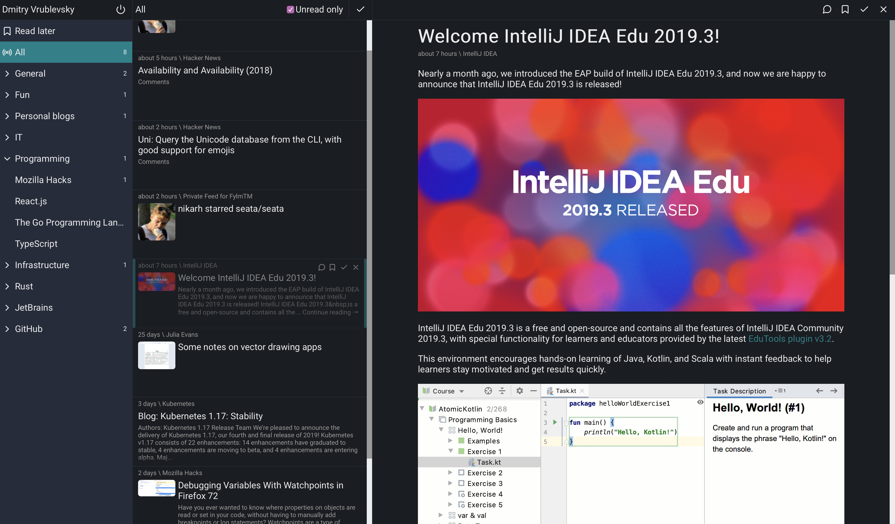

Reader
======

**Reader** is simple, small and fast news aggregator written in Rust.

* Available as a single static binary, no dependencies.
* Responsive web UI.
* Multiple [sources](#sources).
* Low CPU and memory usage.



#### Features

**Supported browsers:** latest versions of Chrome, Firefox, Edge, Safari.

- [x] Web UI
- [ ] Mobile Web UI
- [x] Multi-user
- [x] Categories
- [x] Read later
- [x] Option to show only unread posts
- [ ] Shortcuts
- [ ] Category & feed management
- [ ] User management

#### Sources

- [x] RSS
- [x] Atom
- [ ] Hacker News Best
- [ ] Twitter

## Configuration

Reader can be configured with either `Rocket.toml` file or environment variables.

Example, which lists all possible configuration parameters and their defaults:

```
# Rocket.toml
[global]
address = "0.0.0.0"           # ROCKET_ADDRESS
port = 8000                   # ROCKET_PORT

# Path where SQLite database will be created
db_path = "db.sqlite"         # ROCKET_DB_PATH
# SQLite connection pool size
db_pool_size = 10             # ROCKET_DB_POOL_SIZE

# Whether Reader should periodically update all feeds
feeds_update_enabled = true   # ROCKET_FEEDS_UPDATE_ENABLED
# How long to wait between feed updates in minutes
feeds_update_interval = 10    # ROCKET_FEEDS_UPDATE_INTERVAL

# If set to true Reader will look for `fixture.sql` file and apply it to a database.
# As an example, it is used in development to load sample data.
# Alternatively it can be used to add any data you want to a database (i.e. create users).
# !!! Use cautiously !!!
load_fixture = false
```

## Deployment

Check out [docs/infrastructure.md](./docs/infrastructure.md) on deployment notes.

## Development

**Requirements:**

* Rust nightly (install via [rustup](https://rustup.rs/)).
* [Cargo make](https://github.com/sagiegurari/cargo-make)
* [rustfmt](https://github.com/rust-lang/rustfmt)
* [Node](https://nodejs.org)
* [Yarn](https://yarnpkg.com)

**Optional:**

* [insta](https://github.com/mitsuhiko/insta) (nice snapshot review/update workflow)

```sh
rustup default nightly
rustup component add rustfmt
cargo install cargo-make

# For user-friendly review of snapshots in integration tests, when they fail.
cargo install cargo-insta
```

Build process is orchestrated by `cargo make`.
Check [Makefile.toml](./Makefile.toml) to find out details behind these command.

**Build release:**

```sh
cargo make build
```

**Verify:**

```sh
cargo make verify
```

**Verify (with automatic formatting and lint fixes):**

```sh
cargo make fix
# or
cargo make
```

**Notes:**

* Add `ROCKET_LOAD_FIXTURE=true` environment variable when running with `cargo run` to load sample data.

## License

Licensed under [GNU General Public License v3.0](https://github.com/FylmTM/Reader/blob/master/LICENSE).
